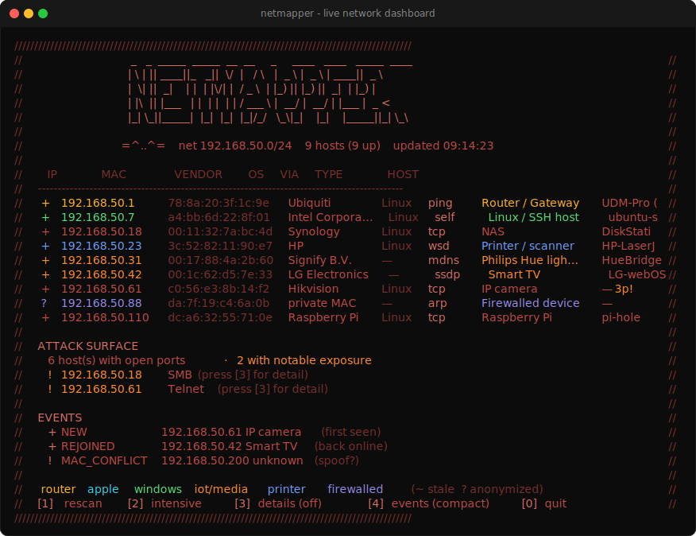

# netmapper

> A zero-dependency, no-admin live LAN scanner and device fingerprinter with a terminal dashboard.


A live local-network monitoring dashboard for your console: a plain terminal
view (ANSI colors, a device table, an attack-surface summary, and a live event
feed) that continuously discovers every device on your network, identifies each
one (vendor, OS, device type), and flags devices joining/leaving in real time.
Pure Python standard library, no admin rights required.


## Demo



<details>
<summary>Plain-text version</summary>

```text
////////////////////////////////////////////////////////////////////////////////////////////////////
//                _   _  _____  _____  __  __     _     ____   ____   _____  ____                 //
//               | \ | || ____||_   _||  \/  |   / \   |  _ \ |  _ \ | ____||  _ \                //
//               |  \| ||  _|    | |  | |\/| |  / _ \  | |_) || |_) ||  _|  | |_) |               //
//               | |\  || |___   | |  | |  | | / ___ \ |  __/ |  __/ | |___ |  _ <                //
//               |_| \_||_____|  |_|  |_|  |_|/_/   \_\|_|    |_|    |_____||_| \_\               //
//                                                                                                //
//              =^..^=    net 192.168.50.0/24    9 hosts (9 up)    updated 09:14:23               //
//                                                                                                //
//     IP              MAC               VENDOR        OS     VIA     TYPE              HOST      //
//  --------------------------------------------------------------------------------------------  //
//  +  192.168.50.1    78:8a:20:3f:1c:9e Ubiquiti      Linux  ping    Router / Gateway  UDM-Pro ( //
//  +  192.168.50.7    a4:bb:6d:22:8f:01 Intel Corpora… Linux  self    Linux / SSH host  ubuntu-s //
//  +  192.168.50.18   00:11:32:7a:bc:4d Synology      Linux  tcp     NAS               DiskStati //
//  +  192.168.50.23   3c:52:82:11:90:e7 HP            Linux  wsd     Printer / scanner HP-LaserJ //
//  +  192.168.50.31   00:17:88:4a:2b:60 Signify B.V.  —      mdns    Philips Hue ligh… HueBridge //
//  +  192.168.50.42   00:1c:62:d5:7e:33 LG Electronics —      ssdp    Smart TV          LG-webOS //
//  +  192.168.50.61   c0:56:e3:8b:14:f2 Hikvision     Linux  tcp     IP camera         —  3p!    //
//  ?  192.168.50.88   da:7f:19:c4:6a:0b private MAC   —      arp     Firewalled device —         //
//  +  192.168.50.110  dc:a6:32:55:71:0e Raspberry Pi  Linux  tcp     Raspberry Pi      pi-hole   //
//                                                                                                //
//  ATTACK SURFACE                                                                                //
//   6 host(s) with open ports   ·   2 with notable exposure                                      //
//   ! 192.168.50.18   SMB   (press [3] for detail)                                               //
//   ! 192.168.50.61   Telnet   (press [3] for detail)                                            //
//                                                                                                //
//  EVENTS                                                                                        //
//   + NEW            192.168.50.61 IP camera  (first seen)                                       //
//   + REJOINED       192.168.50.42 Smart TV  (back online)                                       //
//   ! MAC_CONFLICT   192.168.50.200 unknown  (spoof?)                                            //
//                                                                                                //
//  router  apple  windows  iot/media  printer  firewalled   (~ stale  ? anonymized)              //
//  [1] rescan   [2] intensive   [3] details (off)   [4] events (compact)   [0] quit              //
////////////////////////////////////////////////////////////////////////////////////////////////////
```

</details>

> Device types are color-coded (see the legend row): amber router, cyan Apple, green Windows/self,
> orange IoT/media, blue printer, violet anonymized, on a red frame. The image is
> `docs/screenshot.svg`, generated from made-up sample data (not a real network).

## Quick start

**Double-click `start-dashboard.bat`** (press `0` to quit), or from a terminal:

```
cd netmapper
python -m netmapper              # the live console dashboard, driven by a number menu
```

(The first scan takes ~15-20s to populate; it then rescans every 30s.)

## What it does

- **Discovers hosts every way it can** - concurrent ping sweep (with **retries**
  so packet loss can't hide a host), the ARP table, TCP-connect probing,
  **active SSDP + WS-Discovery solicitation** (catches printers/cameras/TVs/Windows
  that ignore ping), and **IPv6 neighbor discovery** (stirs `ff02::1` and reads the
  neighbor cache, correlating by MAC - so dual-stack and IPv6-only devices show
  up). The `Via` column shows how each host was found.
- **Identifies vendors** from the MAC's OUI using the authoritative IEEE registry
  (~40k prefixes) - so a raw `c8:9e:43:...` becomes "NETGEAR".
- **Detects randomized/private MACs** - the locally-administered bit modern phones
  flip for privacy - algorithmically, no database needed.
- **Fingerprints the OS** from the ping reply's TTL (Windows 128 / Linux/Android 64
  / network gear 255).
- **Resolves names four ways** - reverse-DNS, then from-scratch **NetBIOS**,
  **mDNS/Bonjour**, and **LLMNR** queries. This unmasks anonymized
  (randomized-MAC) hosts: mDNS names Apple/IoT gear, LLMNR/NetBIOS name Windows
  PCs. The details inspector tags each name with the protocol that found it.
- **Fingerprints device type** by scoring *all* signals together - vendor, open
  ports, advertised mDNS services, OS/TTL, and service banners - into a
  confidence-rated guess with evidence (e.g. "IoT (ESP32/ESP8266), 70%").
- **Live console dashboard, always on** - fuses **active scanning**, **passive
  listening** (silently harvesting mDNS/SSDP/LLMNR chatter), and
  **change-monitoring** into one real-time view: a device table, an **attack-surface
  summary**, and a live event feed (NEW / REJOINED / GONE / MAC_CONFLICT /
  VENDOR_CHANGED / IP_CHANGED). Driven by a **number menu** at the bottom: `1`
  rescan · `2` intensive scan · `3` per-device details inspector (↑/↓ to select) ·
  `4` toggle the events view (compact/expanded) · `0` quit.
- **Attack-surface read** - open ports are mapped to service names and the notable
  ones (Telnet, FTP, SMB, RDP, VNC, NFS, exposed databases) are flagged, with a
  per-host exposure badge and a network-wide summary.
- **Service-version detection** - grabs service banners and surfaces versions
  (e.g. `OpenSSH_8.4`, `nginx/1.18.0`) in the details inspector.
- **Intensive scan** - press `2` (or run with `--intensive`) for a much wider port
  sweep (~110 ports) with extra retries, to identify devices the quick pass missed.
- **Stale-ghost filtering** - distinguishes genuinely-present devices from lingering
  ARP/IPv6 cache entries (e.g. a phone that rotated its MAC), via OS neighbor state.
- **Zero dependencies, no admin** - uses the OS `ping`/`arp` and TCP connect scans,
  so it needs no raw sockets, no elevation, and no third-party packages.

## Usage

```bash
python -m netmapper                      # live console dashboard (number menu: 1 rescan, 2 intensive, 0 quit)
python -m netmapper --intensive          # always deep-scan (~110 ports + more retries)
python -m netmapper 192.168.1.0/24       # monitor a specific network
python -m netmapper --interval 15        # rescan every 15s
python -m netmapper --no-solicit --no-ipv6   # lighter/faster discovery passes
```

A background thread actively rescans on a loop while another listens passively;
results are fused into one live view, and `0`/`q` cleanly stops the scanner and
the listener together.

Vendor names come from a local IEEE OUI database at `netmapper/data/oui.csv`
(compact `PREFIX,Vendor` rows). Without it, a few built-in prefixes resolve plus
the algorithmic randomized/multicast detection.

## How it works

The package is eight modules, layered low-level to high-level:

```
netmapper/
├── net.py        core primitives + Device model: subnet math, ping+TTL, ARP/neighbor
│                 tables, reverse DNS, TCP scan, banner grab, role inference
├── identify.py   identity & meaning: MAC->vendor, multi-signal device-type
│                 fingerprint, and port/service attack-surface intelligence
├── probes.py     wire-protocol discovery: DNS codec, NetBIOS/mDNS/LLMNR naming,
│                 SSDP/WS-Discovery solicitation, IPv6 neighbors, passive listening
├── scanner.py    orchestrates one scan: discover -> enrich -> fingerprint
├── engine.py     the live engine (background scan+listen threads, snapshots) +
│                 change tracking (state diff -> NEW/GONE/IP_CHANGED/... events)
├── console.py    the live console renderer (table, attack surface, details, events)
├── __main__.py   the CLI entry point that launches the dashboard
└── __init__.py   package metadata
```

Flow: sweep -> merge ARP -> enrich (MAC, vendor, hostname, ports, role) -> render.
Discovery and port scans are parallelized with `ThreadPoolExecutor`, so a full
/24 scan completes in a few seconds.

### Design notes

- **No admin required** - raw ICMP sockets need elevation; shelling out to the
  OS `ping`/`arp` does not. The port scan is a normal TCP `connect`, not a SYN
  scan, for the same reason.
- **Ping + ARP, not just ping** - many devices (phones especially) don't answer
  ping but do answer ARP; merging both finds far more.
- **Authoritative vendor data** - rather than hardcoding a guess table, it pulls
  the real IEEE OUI registry, so the names are correct.
- **Randomized-MAC awareness** - phones flip the locally-administered bit to
  randomize their MAC for privacy, so I detect that case instead of mislabeling it.

## Tests

```bash
python -m unittest discover -s tests     # stdlib, no network needed
# or: pip install pytest && python -m pytest
```

The suite covers ARP parsing, OUI/vendor logic, role inference, the DNS/NetBIOS
codecs, device fingerprinting, port intelligence, change-monitoring, and the
engine snapshot - all without touching the live network.


## Disclaimer

Scan only networks you own or are authorized to assess. This is an asset-discovery
and inventory tool for your own LAN.
